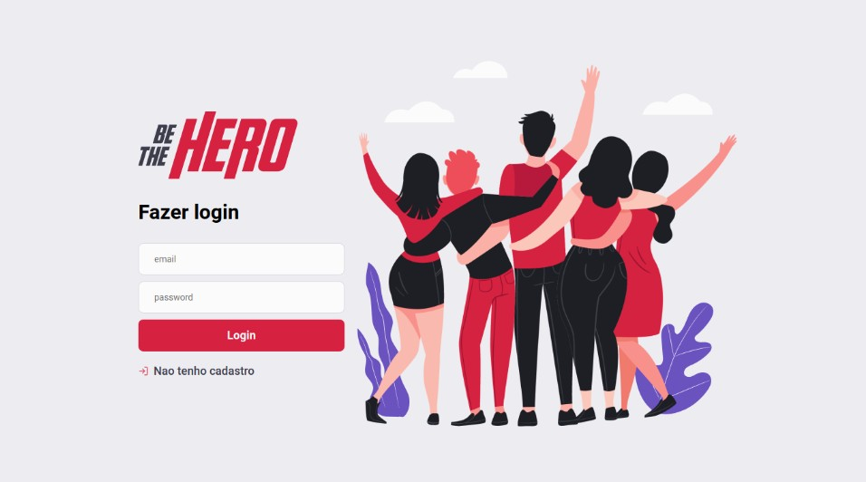

<h1 align="center">
 
  
 
 
Be The Hero
</h1>

Project to assist ONGs that need donations to find people willing to help.
ONGs will register their incidents and people can donate any amount to the cause. To this propose we build a mobile and web app, in a Omnistack Week 11

  
  
  
  

## Features

This app features all the latest tools and practices in mobile development!

- ⚛️ **React Js** — A JavaScript library for building user interfaces
- ⚛️ **React Native** — A lib that provides a way to create native apps for Android and iOS
- 💹 **Node Js** — A web framework for Node Js
- 📄 **Postgres** — A cross-platform and open-source database

## Getting started

1. Clone this repo using `git clone github.com/wellingtonn96/OmnistackWeek11.git`
2. Move yourself to the appropriate directory: `cd ecoleta` 
3. Run `yarn` to install dependencies

### Getting started with the backend server

1. Move yourself to the backend folder: `cd backend`
2. Run`yarn sequelize-cli db:create` to create the database  
3. Run`yarn sequelize-cli db:migrate` to create the tables  
4. Run `yarn dev` to start the server

### Getting started with the frontend app

1. Move yourself to the frontend folder: `cd frontend`
2. Run `yarn install` to install the dependencies
3. Run `yarn start` to start the web application

### Getting started with the mobile app

1. Move yourself to the mobile folder: `cd mobile`
2. Run `yarn install` to install the dependencies
2. Run `yarn start` to start the mobile app

## License

This project is licensed under the MIT License - see the [LICENSE](https://opensource.org/licenses/MIT) page for details.
